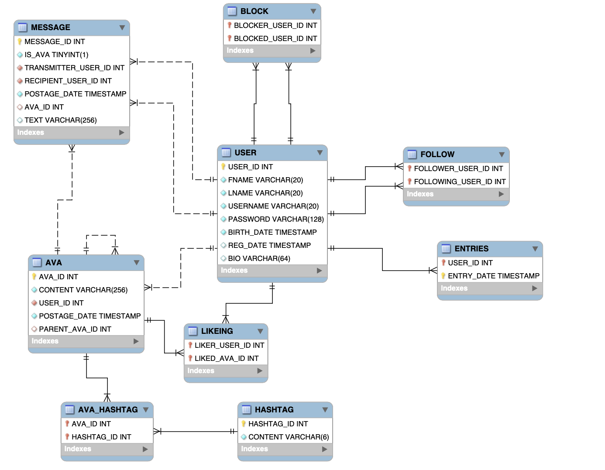

# Twitter Simulation Database System

## Project Information

**Description:**
This GitHub repository hosts the code for the design and implementation of a database system created for a Twitter Simulation. The project utilizes MySQL and Java for building and managing the database.

**Tools:**
- MySQL
- Java

## Project Summary

This project is dedicated to crafting a comprehensive database system tailored for a Twitter Simulation. The primary objectives are as follows:

- Designing a robust database using an entity-relation model, complete with foreign keys.
- Skillfully employing SQL to define and manage relationships between entities, including many-to-many and many-to-one relationships.
- Providing a user-friendly interface to interact with the implemented database model.

To access and manipulate data within the database, a user interface is essential. In this project, a MySQL connection in Java has been established. Users can seamlessly interact with the database by inputting commands through the Java Command-Line Interface (CLI). This straightforward yet effective approach simplifies the database's utilization and management.

